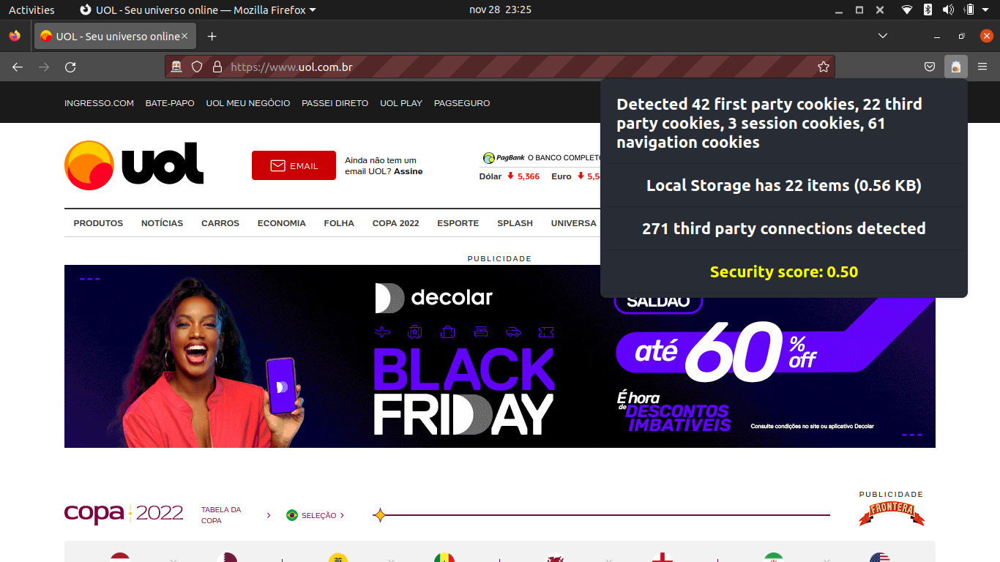

# Cookie Pot

Cookie Pot é uma web extension construída para o Firefox que executa um scan simples na página atual aberta no navegador, procurando por cookies, verificando se estes são seguros, analisando o tamanho do Local Storage e verificando conexões com terceiros. Cookie Pot ainda calcula um score de segurança para a página.

## Dados analisados

### Cookies (C)

Os cookies são fundamentais para uma boa navegação na web como é hoje em dia, mas dentre os cookies existem aqueles que são seguros e os que não são. Aqui, fazemos a separação entre cookies first party e third party, session ou navigation e o score para os cookies é a razão entre o número de cookies seguros sobre o número total de cookies.

### Local Storage (LS)

O Local Storage do navegador é muito útil para salvar dados que possam ser acessados constantemente pela página, garantindo que ela está acessível em memória local e basta ser lida. Os navegadores definem um tamanho máximo que uma aplicação pode usar do Local Storage (5120 KB no caso do Firefox), portanto, o score aqui é a porcentagem de memória livre. Isso porque, uma quantidade muito grande de memória sendo utilizada pode significar algum perigo para o usuário, como alguma injeção de script no localStorage.

### Third party requests (TPR)

A capacidade de fazer requisição a terceiros é fundamental para qualquer aplicação web, seja para monetizar fazendo requisição em serviços como Google Ads, puxar informações de algum servidor, exibir mídias como vídeos, músicas, etc. Entretanto, um alto número de requisições a terceiros pode significar tentativa de comunicação com algum servidor que não devia e talvez até tentar enviar informações de navegação do usuário. Por isso o score aqui é a porcentagem de requisições não feitas a terceiros.

## Score de segurança

O score final é dado pela média geométrica entre C, LS e TPR. A escolha da média é porque essa média visa premiar resultados positivos e punir o severamente o score final com os resultados negativos, já que todos os resultados estão entre 0 e 1. Isso acontece porque queremos ser bem rigorosos, então caso um dos pontos analisados traga um ponto de insegurança para o usuário queremos deixá-lo bem avisado.

Entretanto, é dado o dobro de peso para C e LS, visando diminuir a importância do TPR. Isso porque requisições a terceiros são MUITO populares e muito úteis, quase indispensáveis na web moderna e portanto, se dessemos o mesmo peso, a score sempre seria muito baixa.

$$Score(C, LS, TPR) = ^{\frac{1}{5}}\sqrt{C^2 \cdot LS^2 \cdot TPR}$$

## Demonstrações

Algumas demonstrações de uso:

